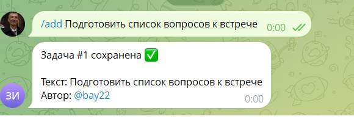
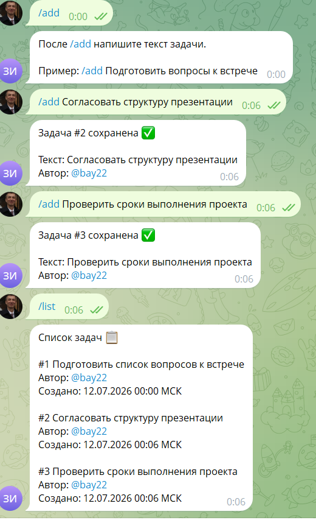
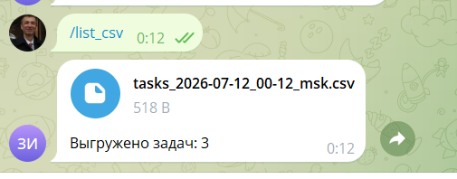
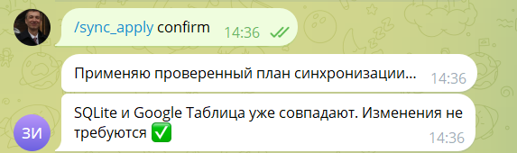
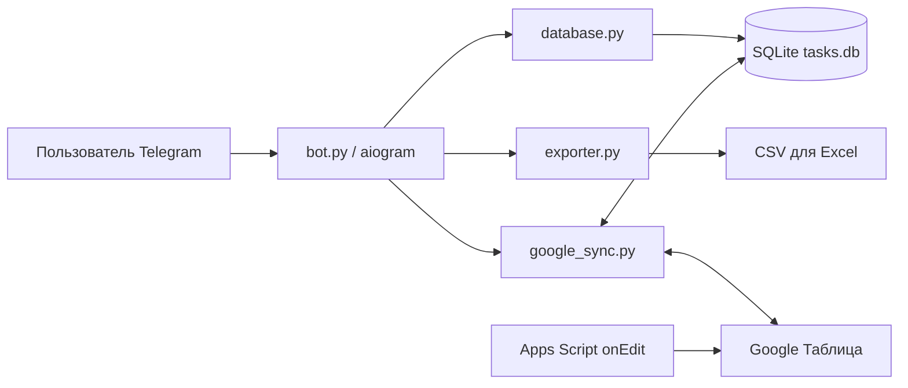

# Telegram Team Tasks Bot

Учебный, но полноценно работающий Telegram-бот для командных задач на Python, aiogram и SQLite. Проект поддерживает добавление и просмотр задач, CSV-выгрузку, сохранение данных после перезапуска и защищённую двустороннюю синхронизацию с Google Таблицей.

Демонстрационный бот: `@evgeny_team_tasks_2026_bot`.

## Возможности

- хранение задач в локальной SQLite без отдельного сервера базы данных;
- команды `/start`, `/add`, `/list`, `/list_csv`;
- CSV в UTF-8 с BOM для корректного открытия в Excel и LibreOffice;
- поля «Статус», «Категория» и `updated_at`;
- синхронизация SQLite ↔ Google Sheets по устойчивому `id`;
- dry-run `/sync`, который ничего не записывает;
- защищённая `/sync_apply confirm` только для владельца;
- автоматическое обновление UTC-времени через Google Apps Script `onEdit`;
- резервная копия SQLite перед реальными изменениями;
- обнаружение конфликтов без случайной перезаписи;
- 43 автоматических теста и сохранённые свидетельства ручных проверок.

## Демонстрация

| Добавление задачи | Список задач |
|---|---|
|  |  |

| CSV в Telegram | Безопасная синхронизация |
|---|---|
|  |  |

## Архитектура



- `bot.py` — команды Telegram и связывание компонентов;
- `config.py` — переменные окружения, секреты и стабильные пути;
- `database.py` — схема SQLite, миграция, транзакции и backup API;
- `exporter.py` — безопасное формирование CSV;
- `google_sync.py` — проверка строк, построение плана и применение синхронизации;
- `google_apps_script/Code.gs` — автоматическая отметка времени ручного изменения;
- `tools/` — отдельные диагностические и служебные команды;
- `tests/` — тесты без обращения к рабочему токену и базе.

## Команды бота

| Команда | Назначение |
|---|---|
| `/start` | Приветствие и справка |
| `/add Текст задачи` | Добавить задачу в SQLite |
| `/list` | Показать задачи в порядке добавления |
| `/list_csv` | Отправить CSV-файл |
| `/sync` | Показать dry-run синхронизации без записи |
| `/sync_apply` | Показать предупреждение и инструкцию подтверждения |
| `/sync_apply confirm` | Применить план; доступно только владельцу |
| `/whoami` | Показать постоянный числовой Telegram ID |

## Стек

- Python 3.14;
- aiogram 3.29.1;
- SQLite3 из стандартной библиотеки Python;
- gspread 6.2.1 и Google Sheets API;
- Google Apps Script;
- unittest.

## Быстрый запуск на Windows

```powershell
py -m venv .venv
.\.venv\Scripts\Activate.ps1
python -m pip install -r requirements.txt
Copy-Item .env.example .env
```

Откройте локальный `.env` и замените заглушки:

```dotenv
BOT_TOKEN=ТОКЕН_ОТ_BOTFATHER
TASKS_DB=tasks.db
GOOGLE_SPREADSHEET_ID=ID_ТАБЛИЦЫ
GOOGLE_SHEET_NAME=Задачи
GOOGLE_SERVICE_ACCOUNT_FILE=credentials/google-service-account.json
TELEGRAM_OWNER_IDS=ВАШ_ЧИСЛОВОЙ_TELEGRAM_ID
```

Настоящие значения нельзя добавлять в Git. ID владельца можно получить командой `/whoami`.

Запуск:

```powershell
python bot.py
```

## Настройка Google Таблицы

1. Создайте проект Google Cloud и включите Google Sheets API.
2. Создайте Service Account и скачайте JSON-ключ.
3. Сохраните ключ локально как `credentials/google-service-account.json`.
4. Предоставьте email сервисного аккаунта доступ редактора к нужной таблице.
5. Создайте лист `Задачи` с колонками:

```text
ID | Задача | Пользователь | Создано (UTC) | Статус | Категория | Обновлено (UTC)
```

6. Откройте в таблице «Расширения → Apps Script» и вставьте содержимое `google_apps_script/Code.gs`.

Простой триггер `onEdit(e)` не требует Deploy: при ручном изменении задачи, статуса или категории он обновляет колонку `Обновлено (UTC)`.

## Правила синхронизации

- задача только в SQLite → `PUSH_TO_GOOGLE`;
- задача только в Google → `PULL_TO_SQLITE`;
- более новый `updated_at` определяет актуальную версию;
- разные данные с одинаковым временем → `CONFLICT`;
- одинаковые данные → `NO_CHANGE`.

При конфликте применение полностью блокируется. Перед первой реальной записью создаётся целостная копия базы через `sqlite3.backup`, после чего SQLite проверяется командой `PRAGMA integrity_check`.

Локальный dry-run:

```powershell
python tools\sync_google_sheet.py
```

Применение:

```powershell
python tools\sync_google_sheet.py --apply
```

## Тестирование

```powershell
python -m unittest discover -s tests -v
```

Покрыты:

- команды и тексты Telegram;
- миграция старой четырёхколоночной базы;
- сохранение и порядок задач;
- CSV и защита от формул;
- чтение конфигурации без раскрытия секретов;
- планирование направлений синхронизации;
- конфликты и повторяющиеся ID;
- транзакционный UPSERT;
- backup и восстановимость SQLite;
- dry-run, применение и проверка владельца.

## Доказательства проверок

Папка `evidence/` содержит скриншоты Telegram и Excel, а также Markdown-протоколы миграции, перезапуска, Google API, Apps Script и защищённой синхронизации.

Основные материалы:

- [сохранение после перезапуска](evidence/PERSISTENCE_RESTART_CHECK.md);
- [чтение Google Таблицы](evidence/GOOGLE_SHEET_READ_CHECK.md);
- [сквозная проверка Google → SQLite](evidence/GOOGLE_APPS_SCRIPT_TRIGGER_CHECK.md);
- [команда `/sync`](evidence/TELEGRAM_SYNC_COMMAND_CHECK.md);
- [защищённая `/sync_apply`](evidence/TELEGRAM_SYNC_APPLY_SECURITY_CHECK.md).
- [проверка безопасной публикации на GitHub](evidence/GITHUB_PUBLICATION_CHECK.md).

## Безопасность

В репозиторий не должны попадать:

- `.env` с токеном и Telegram ID;
- `credentials/*.json` с закрытым ключом;
- `tasks.db` и резервные копии;
- журналы процесса;
- локальное виртуальное окружение.

Все эти пути исключены через `.gitignore`. В `.env.example` находятся только вымышленные значения.

## Учебный контекст

Проект выполнен как расширенная версия домашней работы Zerocoder: минимальный Telegram-бот на Python, aiogram и SQLite с командами добавления, списка и CSV-выгрузки. Google Sheets, Apps Script, резервное копирование и защищённая синхронизация добавлены как портфолио-расширение.

## Лицензия

MIT — см. [LICENSE](LICENSE).
